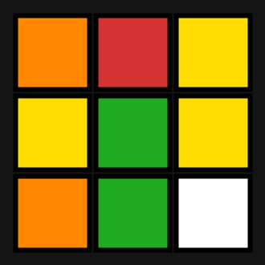

# 🧩 Rubik's Cube Solver — Guide 3D

Application web qui **résout un Rubik's Cube à partir de 6 photos** et **guide l'utilisateur
mouvement par mouvement** sur un **cube 3D animé**.

100 % gratuit, fonctionne **hors-ligne dans le navigateur** : aucune clé API, aucun serveur,
aucune dépendance cloud.



## ✨ Fonctionnalités

- 📷 **Upload des 6 faces** du cube (Haut, Droite, Avant, Bas, Gauche, Arrière)
- 🎨 **Détection des couleurs déterministe** (analyse des pixels — pas d'IA, donc fiable)
- 🧠 **Résolution par l'algorithme de Kociemba** (lib `cubejs`) → solution optimale (~20 mouvements)
- 🎲 **Cube 3D (Three.js)** reproduisant l'état réel de votre cube
- ▶️ **Guidage pas à pas** : Lecture auto, Suivant/Précédent, compteur d'étapes, notation expliquée
- 🖱️ Vue 3D **orientable à la souris**

## 🚀 Utilisation

Aucune installation. Ouvrez simplement le fichier :

```
web/index.html
```

(double-clic, ou glissez-le dans votre navigateur)

1. Chargez une photo de chaque face. Tenez le cube **Blanc en haut, Vert devant**.
2. Cliquez **« Analyser & Résoudre »**.
3. Suivez le guide sur le cube 3D : **▶ Lecture** ou **Suivant / Précédent**.

> 💡 Des **images de test** prêtes à l'emploi (un mélange valide) sont fournies dans
> [`web/test-images/`](web/test-images/) : chargez `1_U_Haut.png` → `6_B_Arriere.png`.

## 📸 Bien photographier (important)

Pour une solution correcte, l'orientation doit être cohérente : tenez le cube
**Blanc en haut, Vert devant**, puis photographiez dans l'ordre **U → R → F → D → L → B**.
Bonne lumière, cube bien cadré et droit, les 9 stickers nets.

## 🔤 Notation

| Lettre | Face | `X` | `X'` | `X2` |
|--------|------|-----|------|------|
| U/D/R/L/F/B | Haut/Bas/Droite/Gauche/Avant/Arrière | horaire | anti-horaire | 180° |

## 🗂️ Structure

```
carre/
├── web/
│   ├── index.html          # L'application (UI + détection + 3D + guidage)
│   ├── lib/                # Three.js + cubejs (solveur), en local
│   └── test-images/        # 6 faces d'un mélange valide pour tester
├── solver-service/         # (optionnel) micro-service Python Kociemba pour n8n
├── n8n-workflow/           # (optionnel) workflow n8n
└── docker-compose.yml      # (optionnel) n8n + solveur
```

## 🛠️ Stack

- [Three.js](https://threejs.org/) — rendu et animation 3D
- [cubejs](https://github.com/ldez/cubejs) — solveur deux phases (Kociemba) en JavaScript
- Détection des couleurs maison (HSV) via `<canvas>`

## 🧩 Variante n8n (optionnelle)

Le dossier `solver-service/` + `docker-compose.yml` contiennent une version où la résolution
se fait côté serveur via un workflow **n8n** appelant un micro-service Python (Kociemba).
La version navigateur (ci-dessus) est la plus simple et la plus fiable.

---

Projet réalisé avec l'aide de Claude Code.
